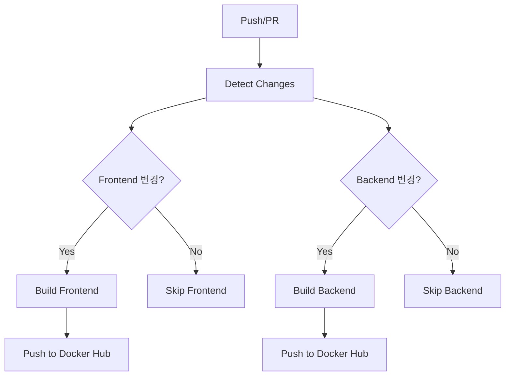

# GitHub Actions 가이드라인

## 📋 목차
1. [개요](#개요)
2. [워크플로우 구조](#워크플로우-구조)
3. [설정 방법](#설정-방법)
4. [주요 개념](#주요-개념)
5. [트러블슈팅](#트러블슈팅)
6. [모범 사례](#모범-사례)

## 개요

이 프로젝트는 **변경 감지 기반 Docker 이미지 빌드 및 배포** 전략을 사용합니다.

### 🎯 목표
- Frontend/Backend 변경 시 해당 서비스만 빌드
- Docker Hub에 자동 푸시
- 빌드 시간 최적화 및 리소스 절약

## 워크플로우 구조



### 📁 워크플로우 파일 위치
```
.github/
└── workflows/
    └── docker-build-push.yml
```

## 설정 방법

### 1. GitHub Secrets 설정

GitHub 리포지토리 **Settings** → **Secrets and variables** → **Actions**에서 추가:

| Secret 이름 | 설명 | 예시 |
|---|---|---|
| `DOCKER_HUB_USERNAME` | Docker Hub 사용자명 | `myusername` |
| `DOCKER_HUB_ACCESS_TOKEN` | Docker Hub Access Token | `dckr_pat_...` |

### 2. Docker Hub Access Token 생성

1. [Docker Hub](https://hub.docker.com) 로그인
2. **Account Settings** → **Security** → **New Access Token**
3. 토큰 이름 입력 (예: `github-actions`)
4. **Read, Write, Delete** 권한 선택
5. 생성된 토큰을 GitHub Secrets에 저장

### 3. Docker Hub Repository 생성

다음 레포지토리들을 미리 생성하거나, 첫 푸시 시 자동 생성됩니다:
- `your-username/my-recipe-app-frontend`
- `your-username/my-recipe-app-backend`

## 주요 개념

### 🔍 변경 감지 (Path Filtering)

```yaml
- name: Detect changes
  uses: dorny/paths-filter@v2
  id: changes
  with:
    filters: |
      frontend:
        - 'frontend/**'
        - 'docker-compose.yml'
      backend:
        - 'backend/**'
        - 'docker-compose.yml'
```

**동작 방식:**
- `frontend/` 폴더 내 파일 변경 → `frontend` 플래그 활성화
- `backend/` 폴더 내 파일 변경 → `backend` 플래그 활성화
- `docker-compose.yml` 변경 → 둘 다 활성화

### 🏗️ 조건부 Job 실행

```yaml
build-frontend:
  needs: detect-changes
  if: needs.detect-changes.outputs.frontend == 'true'
```

**특징:**
- `needs`: 다른 job 완료 후 실행
- `if`: 조건이 참일 때만 실행
- 조건이 거짓이면 job을 완전히 건너뜀

### 🏷️ 이미지 태깅 전략

```yaml
tags: |
  type=ref,event=branch      # 브랜치명 기반
  type=ref,event=pr          # PR 번호 기반  
  type=semver,pattern={{version}}  # 태그 기반
  type=sha,prefix={{branch}}- # SHA 기반
```

**결과 예시:**
- `main` 브랜치 → `my-recipe-app-frontend:main`
- PR #123 → `my-recipe-app-frontend:pr-123`
- v1.0.0 태그 → `my-recipe-app-frontend:1.0.0`
- 커밋 → `my-recipe-app-frontend:main-abc1234`

### 💾 캐시 전략

```yaml
cache-from: type=gha,scope=frontend
cache-to: type=gha,mode=max,scope=frontend
```

**장점:**
- 빌드 시간 단축 (레이어 재사용)
- 각 서비스별 독립적인 캐시
- GitHub Actions 내장 캐시 사용

## 트러블슈팅

### ❌ 자주 발생하는 문제들

#### 1. Docker Hub 로그인 실패
```
Error: Cannot perform an interactive login from a non TTY device
```

**해결책:**
- GitHub Secrets 확인
- Access Token 재생성
- Username 대소문자 확인

#### 2. 빌드 컨텍스트 오류
```
failed to solve: failed to read dockerfile
```

**해결책:**
- Dockerfile 경로 확인
- 컨텍스트 경로와 Dockerfile 경로 일치 여부 확인

#### 3. 변경 감지 안됨
```
Job skipped due to path filtering
```

**해결책:**
- 파일 경로 패턴 확인
- `.github/workflows/` 자체 변경 시에도 테스트 필요

### 🔧 디버깅 방법

#### 1. 로그 확인
- Actions 탭에서 실패한 step 클릭
- 상세 에러 메시지 확인

#### 2. 로컬 테스트
```bash
# 변경된 파일 확인
git diff --name-only HEAD~1 HEAD

# Docker 빌드 테스트
docker build -t test-image ./frontend
```

#### 3. 강제 실행
특정 조건 무시하고 테스트하려면:
```yaml
if: always()  # 조건 무시하고 항상 실행
```

## 모범 사례

### ✅ 권장사항

#### 1. **보안**
```yaml
# Secrets 사용
username: ${{ secrets.DOCKER_HUB_USERNAME }}

# PR에서는 푸시 안함
if: github.event_name != 'pull_request'
```

#### 2. **효율성**
```yaml
# 멀티 플랫폼 빌드
platforms: linux/amd64,linux/arm64

# 캐시 활용
cache-from: type=gha
cache-to: type=gha,mode=max
```

#### 3. **가독성**
```yaml
# 명확한 Job 이름
build-frontend:
build-backend:

# 상세한 Step 이름  
- name: Build and push Frontend image
```

### 🚫 피해야 할 것들

#### 1. **하드코딩**
```yaml
# ❌ 나쁜 예
images: username/my-app

# ✅ 좋은 예  
images: ${{ env.DOCKER_HUB_USERNAME }}/my-app
```

#### 2. **과도한 복잡성**
```yaml
# ❌ 너무 복잡한 조건
if: github.ref == 'refs/heads/main' && github.event_name == 'push' && contains(github.event.head_commit.message, '[deploy]')

# ✅ 단순한 조건
if: github.ref == 'refs/heads/main'
```

#### 3. **캐시 무시**
```yaml
# ❌ 캐시 없이 매번 새로 빌드
# cache 설정 없음

# ✅ 캐시 활용
cache-from: type=gha
```

## 추가 학습 리소스

### 📚 공식 문서
- [GitHub Actions 공식 문서](https://docs.github.com/en/actions)
- [Docker Build Push Action](https://github.com/docker/build-push-action)
- [Path Filter Action](https://github.com/dorny/paths-filter)

### 🛠️ 확장 아이디어
- [ ] 테스트 단계 추가 (Jest, Pytest)
- [ ] 보안 스캔 (Trivy, Snyk)  
- [ ] 성능 테스트
- [ ] Slack/Discord 알림
- [ ] 자동 배포 (Kubernetes, ECS)
- [ ] 환경별 배포 (dev, staging, prod)

### 💡 학습 팁
1. **작게 시작**: 간단한 워크플로우부터
2. **단계별 추가**: 기능을 하나씩 추가하며 학습
3. **로그 활용**: 실패 시 로그를 자세히 분석
4. **커뮤니티 활용**: GitHub Marketplace에서 다양한 Action 탐색 