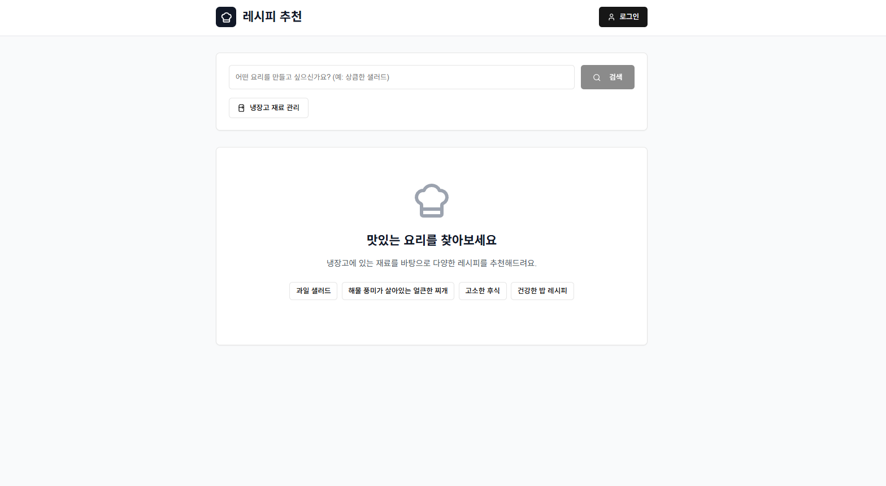
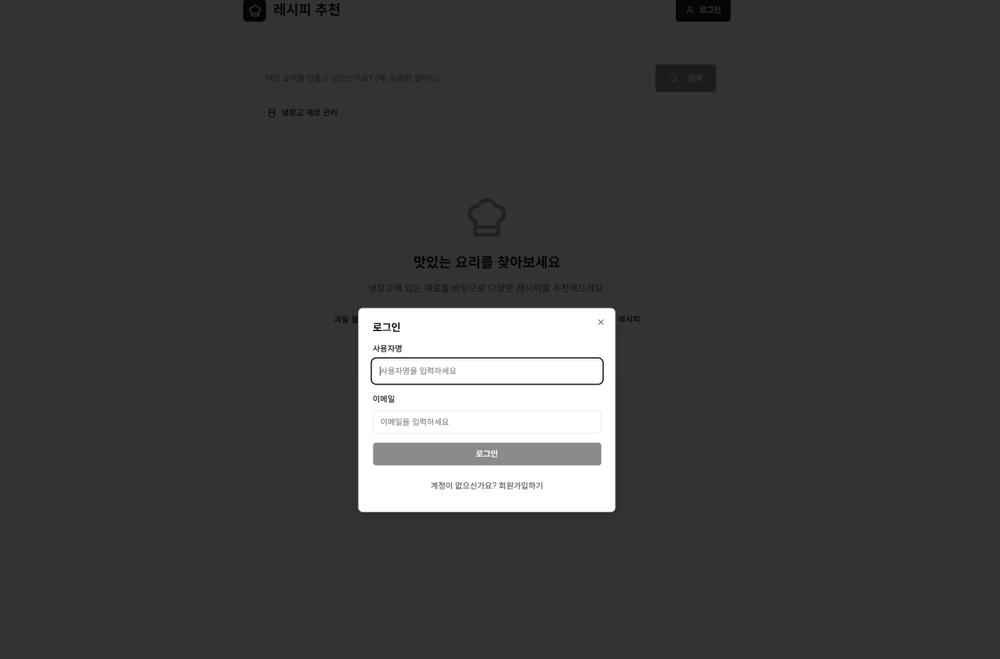
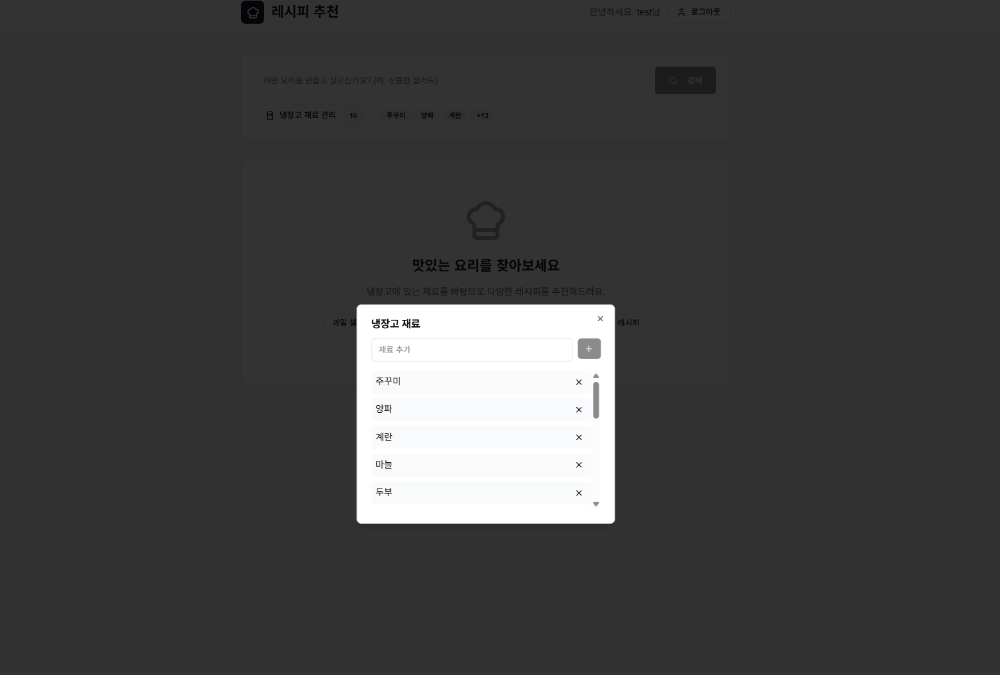
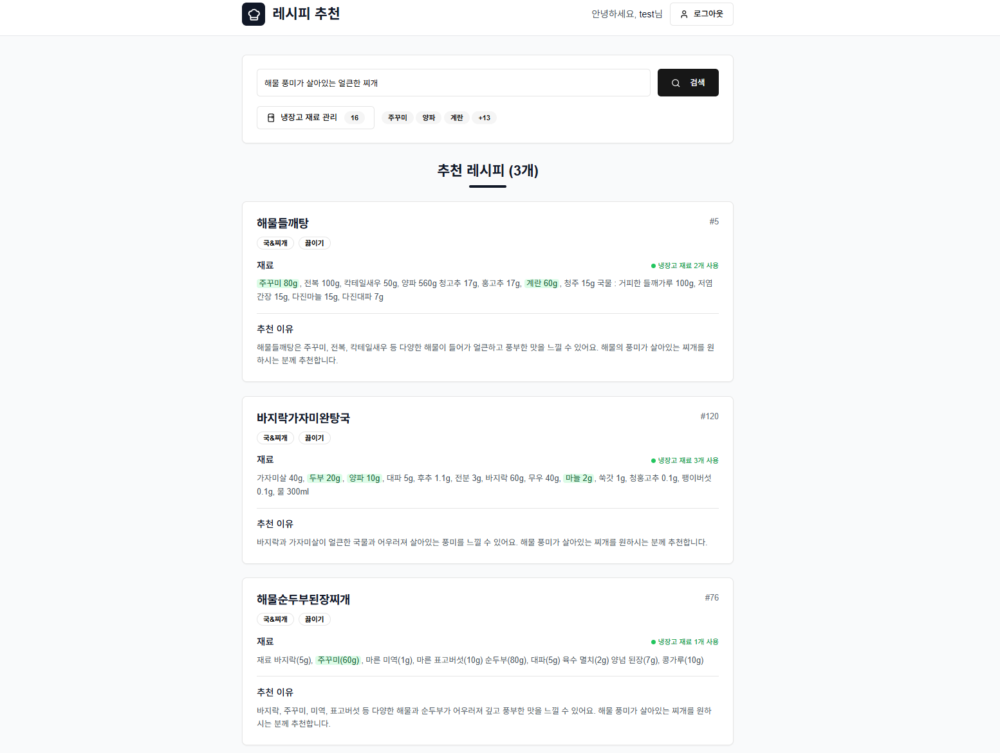

# AI 레시피 추천 시스템

*> 확장 가능한 마이크로서비스 아키텍처 기반의 RAG(Retrieval-Augmented Generation) 레시피 추천 백엔드 시스템*

[](https://github.com/your-username/my-recipe-app)
[](https://fastapi.tiangolo.com/)
[](https://nextjs.org/)
[](https://qdrant.tech/)
[](https://www.mysql.com/)
[](https://qdrant.tech/)
[](https://www.docker.com/)

## 프로젝트 소개

사용자가 냉장고에 있는 재료를 관리하고, AI 기반 RAG(Retrieval-Augmented Generation) 시스템을 통해 맞춤형 레시피를 추천받는 지능형 웹 서비스입니다. 

> **상세한 설계 문서 및 프로젝트 계획**: [PLAN.md](./PLAN.md)

**핵심 특징:**
- **AI 기반 추천**: OpenAI GPT + KoSimCSE-bert를 활용한 의미론적 레시피 검색
- **벡터 검색**: Qdrant 벡터 데이터베이스를 통한 고성능 유사도 검색
- **확장 가능한 아키텍처**: Docker 기반 마이크로서비스 구조
- **모던 UI/UX**: Next.js 14 + TypeScript + Tailwind CSS

## 스크린샷

### 메인 홈페이지

*로그인 전 초기 화면 - 요리 검색 및 냉장고 재료 관리 기능 소개*

### 로그인 화면

*사용자 로그인 입력 화면 - 이메일과 사용자명으로 간편 로그인*

### 냉장고 재료 관리

*냉장고 재료 추가 및 관리 화면 - 보유 재료 등록/삭제 기능*

### 레시피 추천 결과

*AI 기반 레시피 추천 결과 - 냉장고 재료와 매칭되는 재료들이 하이라이트 표시*


## 주요 기능

- **사용자 관리**: 회원가입/로그인 시스템
- **냉장고 재료 관리**: 보유 재료 등록/삭제
- **AI 레시피 추천**: RAG 기반 맞춤형 레시피 추천
- **벡터 검색**: KoSimCSE-bert 모델 기반 의미론적 검색
- **반응형 웹**: Next.js 기반 모던 UI/UX

## 기술 스택

### Backend
- **FastAPI**: REST API 서버
- **SQLModel**: ORM 및 데이터 모델
- **MySQL**: 메인 데이터베이스
- **Qdrant**: 벡터 데이터베이스
- **OpenAI**: 임베딩 및 텍스트 생성
- **KoSimCSE-bert**: 한국어 문장 임베딩

### Frontend
- **Next.js 14**: React 기반 프론트엔드
- **TypeScript**: 타입 안전성
- **Tailwind CSS**: 스타일링
- **shadcn/ui**: UI 컴포넌트

### Infrastructure
- **Docker & Docker Compose**: 컨테이너화
- **GitHub Actions**: CI/CD 파이프라인
- **ELK Stack**: 로깅 시스템 (예정)

## 빠른 시작

### 사전 요구사항
- Docker & Docker Compose
- OpenAI API Key
- 공공데이터포털 API Key (식품안전나라)

### 1. 저장소 클론
```bash
git clone https://github.com/your-username/my-recipe-app.git
cd my-recipe-app
```

### 2. 환경 변수 설정
```bash
cp env.example .env
```

`.env` 파일을 열어 다음 값들을 설정하세요:
```env
# OpenAI API
OPENAI_API_KEY=your_openai_api_key_here

# 공공데이터포털 - 식품안전나라
FOOD_SAFETY_API_KEY=your_food_safety_api_key
FOOD_SAFETY_SERVICE_ID=COOKRCP01

# Docker Hub (배포용)
DOCKER_HUB_USERNAME=your_docker_username
DOCKER_HUB_ACCESS_TOKEN=your_docker_token
```

### 3. 애플리케이션 실행
```bash
# 전체 서비스 시작
docker compose up -d

# 초기 데이터 로딩
docker compose --profile init up init-data
```

### 4. 접속
- **프론트엔드**: http://localhost:3000
- **API 문서**: http://localhost:8000/docs
- **Qdrant 대시보드**: http://localhost:6201/dashboard

## 프로젝트 구조

```
my-recipe-app/
├── backend/                 # FastAPI 백엔드
│   ├── app/
│   │   ├── models.py       # SQLModel 데이터 모델
│   │   ├── db.py           # 데이터베이스 설정
│   │   ├── main.py         # FastAPI 앱
│   │   └── routers/        # API 엔드포인트
│   ├── recipe_rag_pipeline.py  # RAG 추천 파이프라인
│   └── seed_data.py        # 초기 데이터 생성
├── frontend/               # Next.js 프론트엔드
│   ├── app/                # App Router
│   ├── components/         # React 컴포넌트
│   └── types/              # TypeScript 타입
├── .github/workflows/      # GitHub Actions CI/CD
└── docker-compose.yml      # Docker 서비스 설정
```

## 개발 환경 설정

### 백엔드 개발
```bash
cd backend
python -m venv venv
source venv/bin/activate  # Windows: venv\Scripts\activate
pip install -r requirements.txt
uvicorn app.main:app --reload
```

### 프론트엔드 개발
```bash
cd frontend
pnpm install
pnpm dev
```

## API 문서

### 주요 엔드포인트

#### 사용자 관리
- `POST /api/users` - 회원가입
- `POST /api/users/login` - 로그인

#### 냉장고 재료 관리
- `GET /api/user_ingredients/{user_id}` - 냉장고 재료 조회
- `POST /api/user_ingredients` - 재료 추가
- `DELETE /api/user_ingredients/{user_id}/{name}` - 재료 삭제

#### 레시피 조회
- `GET /api/recipes` - 레시피 목록 조회

#### 레시피 추천
- `POST /api/rag/recommend` - AI 기반 레시피 추천

자세한 API 문서는 http://localhost:8000/docs 에서 확인할 수 있습니다.

## 데이터 플로우

1. **사용자 재료 등록** → 냉장고 재료 DB 저장
2. **레시피 추천 요청** → 사용자 query 벡터화
3. **벡터 검색** → Qdrant에서 유사 레시피 검색
4. **재료 매칭** → 냉장고 재료와 레시피 재료 매칭도 계산
5. **LLM 생성** → OpenAI로 최종 추천 문구 생성

## 환경 설정

### 개발 환경
```bash
docker compose up -d mysql qdrant
# 백엔드/프론트엔드는 로컬에서 개발
```

### 프로덕션 환경
```bash
docker compose -f docker-compose.prod.yml up -d
```

### Nginx 포함 전체 스택
```bash
docker compose --profile nginx up -d
```

## 모니터링 및 로깅

- **컨테이너 헬스체크**: Docker Compose 내장
- **API 메트릭스**: FastAPI 내장 메트릭스
- **로깅**: ELK Stack 연동 예정

## 배포

GitHub Actions를 통한 자동 배포가 설정되어 있습니다:
- `main` 브랜치 푸시 시 Docker Hub에 이미지 빌드/푸시
- 변경 감지 기반 선택적 빌드
- 멀티 아키텍처 지원 (amd64, arm64)

---

## 빠른 실행 명령어

```bash
# 전체 애플리케이션 시작
docker compose up -d && docker compose --profile init up init-data

# 개발 환경
docker compose up -d mysql qdrant
```

## 관련 문서

- [PLAN.md](./PLAN.md) - 상세한 프로젝트 설계 및 계획 문서
- [performance_evaluation_report.md](./performance_evaluation_report.md) - 성능 평가 보고서
- [docker-deployment-guide.md](./docker-deployment-guide.md) - Docker 배포 가이드
- [docker-github-actions-guide.md](./docker-github-actions-guide.md) - GitHub Actions 배포 가이드 