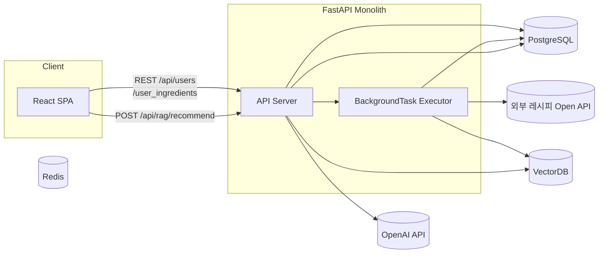
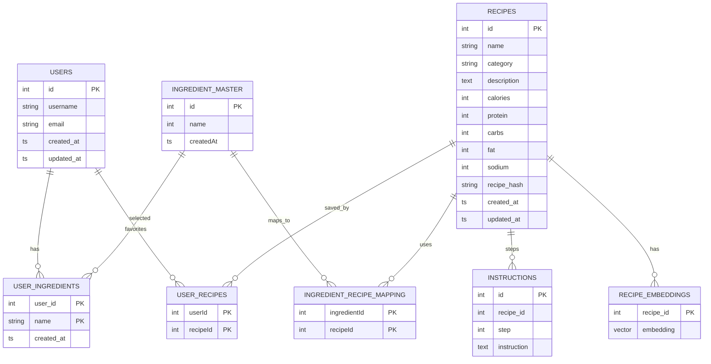
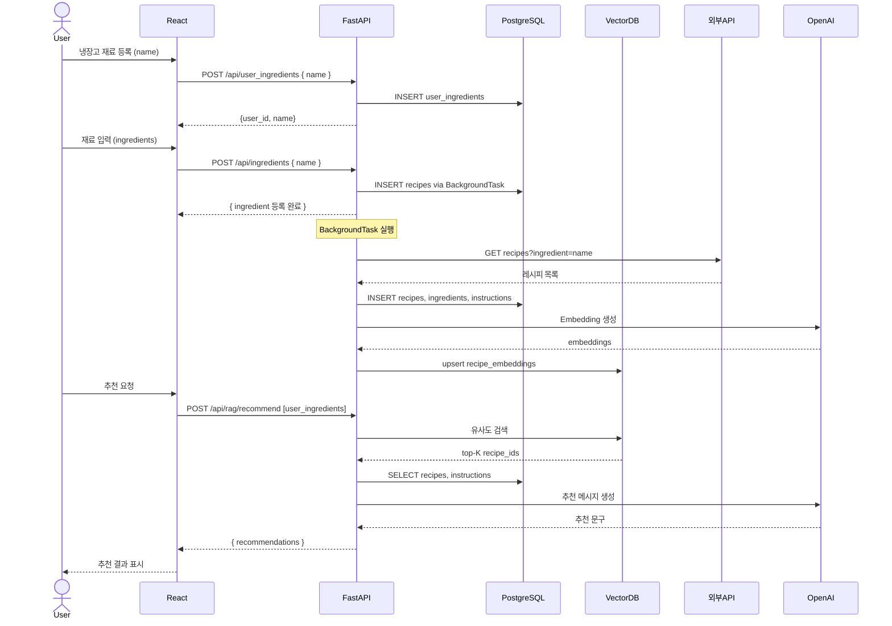

# my-recipe-app
사용자가 냉장고에 있는 재료를 입력하면, 해당 재료로 만들 수 있는 요리를 추천하고, 추천된 요리의 영양소를 분석하여 제공하는 시스템.
---

## 1. 요구사항 분석

### 1.1. 기능적 요구사항

| ID     | 기능                                | 설명                                                                          |
|:-------|:-----------------------------------|:-----------------------------------------------------------------------------|
| FR-1   | 사용자 관리                         | 사용자 가입·조회·수정·삭제 (users)                                          |
| FR-2   | 보유 재료 관리                      | 사용자가 냉장고에 가진 재료 등록·조회·삭제 (user_ingredients)               |
| FR-3   | 레시피 인제스천                     | 사용자가 새로운 재료를 등록할 때마다 외부 오픈 API에서 레시피를 가져와 저장 (recipes, ingredients, instructions, recipe_embeddings) |
| FR-4   | RAG 추천                            | 저장된 레시피 임베딩 검색 → LLM 호출 → 사용자에게 추천 문구 반환             |
| FR-5   | 사용자별 레시피 저장/즐겨찾기       | 사용자가 마음에 드는 레시피를 즐겨찾기 형태로 저장 (user_recipes)            |
| FR-6   | API 자동 문서화                     | FastAPI Swagger/OpenAPI UI 제공                                             |
| FR-7   | 프론트엔드 연동                     | React SPA에서 REST API 호출                                                  |

### 1.2. 비기능적 요구사항

- **응답성**  
  - CRUD: ≤100ms  
  - RAG 추천: ≤2s  
- **확장성**  
  - 단일 FastAPI → 필요 시 BackgroundTask → Celery 전환  
  - VectorDB(Weaviate/Pinecone) 클러스터 확장 가능  
- **신뢰성/내결함성**  
  - PostgreSQL·Redis는 Docker 볼륨으로 데이터 유지  
  - 컨테이너 자동 재시작 설정(restart: always)  
- **보안**  
  - JWT 인증·권한 관리 여지  
  - `.env`로 시크릿 관리  
- **운영/모니터링**  
  - 로그(uvicorn, 백그라운드) 중앙집중(ELK/Loki)  
  - 메트릭(Prometheus+Grafana)

### 1.3. 우선순위

1. **핵심**: FR-1, FR-2, FR-3, FR-4, FR-6  
2. **확장**: FR-5, Celery 전환, VectorDB 최적화  
3. **보안·모니터링**: 인증·권한, 로깅·메트릭  

### 1.4. 벡터 검색 품질 평가 기준

| 항목 | 평가 포인트 |
|------|------------|
| 연관어·문맥 포착     | 키워드에 직접 포함되지 않은 재료(오징어, 전복 등)나 문맥적 표현(바다 향, 시원한 맛 등)이 Top-K 결과에 반영되는지 |
| 재료 일치 | Top-K 결과에 사용자가 보유한 재료가 최소 1개 이상 포함되는지 확인 |
| 영양 선호/기피 반영 | “고단백”, “저칼로리”, “저나트륨” 등 선호하거나 기피하는 영양 조건을 입력했을 때 결과가 해당 조건 순으로 잘 정렬·컷오프 되는지 |
| 요리 유형 | 요청한 조리법(찜/무침/국 등)이 Top-K 결과 안에 포함되는지 |

---

## 2. 아키텍처 설계

### 2.1. 컨테이너 다이어그램

### 2.2. 레이어드 컴포넌트

1. **Presentation Layer**  
   - React SPA (재료·추천 UI)  
   - Axios 호출  

2. **API Layer (FastAPI)**  
   - Users Router (`/api/users`)  
   - UserIngredients Router (`/api/user_ingredients`)  
   - Recipes Router (`/api/recipes`)  
   - RAG Router (`/api/rag/recommend`)  
   - BackgroundTasks: `fetch_and_store_recipes(ingredient)`  
   - Pydantic/SQLModel → PostgreSQL  

3. **BackgroundTask Executor**  
   - `fastapi.BackgroundTasks` 초기 → Celery + Redis 전환 가능  

4. **Data Layer**  
   - **PostgreSQL**: users, user_ingredients, recipes, ingredients, instructions, user_recipes  
   - **VectorDB**: recipe_embeddings  

5. **Integration Layer**  
   - 외부 레시피 API 클라이언트  
   - OpenAI Embedding & Completion 클라이언트  

---

### 2.3. 데이터 모델 (ERD)

- **제약·인덱스** (모델에 걸린 Unique/PK) 
  - USER: username, email   UNIQUE
  - USER_INGREDIENT: PK(userId, ingredientId)
  - RECIPE: name, recipeHash   UNIQUE
  - INGREDIENT_RECIPE_MAPPING: PK(ingredientId, recipeId)
  - INSTRUCTION: UNIQUE(recipeId, step)
  - USER_RECIPE: PK(userId, recipeId)
  - RECIPE_EMBEDDING: PK(recipeId)

- 물리 인덱스 (보조 인덱스)
  - INDEX recipes(category)
  - INDEX ingredients(name)
---

### 2.4. 시퀀스 다이어그램

---

### 2.5. 배포 & 운영

- **docker-compose** (dev):  
  - services: `db`, `api`, `vector-db`, `redis`  
- **CI/CD**: GitHub Actions → Docker Hub → Prod  
- **모니터링**:  
  - 로그: ELK Stack / Grafana Loki  
  - 메트릭: Prometheus → Grafana  

---

### 2.6 데이터 수집 전략
- 하이브리드 수집 전략 - 실시간 Fetching PoC 단계에서 “필요할 때만 가져오는” 방식
- 안정적이고 확장 가능한 레시피 추천 서비스를 구축을 위해서는 인기 재료 중심 배치 수집

---

### 프로젝트 일정

아래는 **5개 스프린트**의 요약과, 각 스프린트별 주 단위 세부 일정입니다. Sprint 1만 1주차로 축소했고, 나머지는 2주씩 구성했습니다.

| 스프린트   | 기간               | 핵심 목표                                                         |
|:-----------|:-------------------|:------------------------------------------------------------------|
| **Sprint 1** | 4/28(월) – 5/2(금)     | • 레포·Docker Compose 환경 세팅 • DB 모델 정의 & 마이그레이션 • FastAPI 스켈레톤 엔드포인트 • React 초기화 & Axios 연동 확인 |
| **Sprint 2** | 5/5(월) – 5/9(금)   | • Users / User_Ingredients CRUD • BackgroundTask 뼈대 추가 • 외부 레시피 API 연동 & 저장 로직 |
| **Sprint 3** | 5/12 (월) – 6/13 (금)   (2주 연장)    | • OpenAI Embedding 모듈 구현 • recipe_embeddings 테이블/VectorDB 연동 • 임베딩 upsert 파이프라인 완성 • VectorDB 검색 품질 기준 목표치 설정 |
| **Sprint 4** | 6/16 (월) – 6/27 (금)    | • `/api/rag/recommend` 추천 로직(벡터 검색+LLM) • React 추천 UI 통합 • 단위·통합 테스트 |
| **Sprint 5** | 6/30 (월) – 7/18 (금)    | • CI/CD 파이프라인 구축 • 모니터링·로깅 설정 • 최종 리팩토링 & 문서 정리 |

---

## 주 단위 세부 일정

### Sprint 1 (4/28 – 5/2)
#### 4/28 – 5/2
  - GitHub 레포 생성 & 브랜치 전략  
  - `docker-compose.yml` (Postgres + FastAPI) 작성  
  - SQLModel로 `users`, `user_ingredients`, `recipes` 모델 정의  
  - Alembic 마이그레이션 초기 설정  
  - FastAPI 앱 초기화 & 스켈레톤 라우터 등록(`/api/users`, `/api/user_ingredients`, `/api/recipes`)  
  - Swagger/OpenAPI UI 확인  
  - Create React App 초기화  
  - `axios` 인스턴스 설정  
  - 빈 컴포넌트(재료 입력 폼, 유저 등록 폼) 추가  
  - 백엔드 ↔ 프론트 e2e 흐름 점검 (폼 → API 호출 → 응답)  
  - 스프린트 회고 & Sprint 2 계획  

---

### Sprint 2 (5/5 – 5/9)

#### 5/5 – 5/9
- Users CRUD API 구현 (`GET`, `POST`, `PUT`, `DELETE /api/users`)  
- User_Ingredients CRUD API 구현 (`/api/user_ingredients`)  
- FastAPI `BackgroundTasks` 뼈대 추가  
- `fetch_recipes_from_api(ingredient)` 모듈 작성  
- BackgroundTask 내부에서 레시피 수집 → `recipes`, `ingredients`, `instructions` 저장  
- 기본 에러 핸들링 및 응답 검증  

---

### Sprint 3 (5/12 – 6/13)

#### 5/12 – 5/23
- OpenAI Embeddings API 호출 클라이언트 구현  
- `recipe_embeddings` 테이블 또는 외부 VectorDB 스키마 & 클라이언트 설정  

#### 5/26 – 6/13
- 레시피 저장 시 임베딩 생성 → upsert 파이프라인 완성  
- 벡터 DB 인덱싱 검증 및 간단 성능 측정  
- VectorDB 검색 품질 기준 목표치 설정

---

### Sprint 4 (6/16 – 6/27)

#### 6/16 – 6/20
- `/api/rag/recommend` 엔드포인트 구현:  
  1. 사용자 재료 임베딩 → 벡터 검색  
  2. 상위 N개 레시피 조회 → OpenAI LLM 호출  
- 결과 반환 구조 정의  

#### 6/23 – 6/27
- React에서 추천 요청 UI 연동 & 결과 렌더링  
- 단위 테스트 및 통합 테스트 작성  
- 주요 버그 수정  

---

### Sprint 5 (6/30 – 7/4)

#### 6/30 – 7/18
- GitHub Actions 워크플로우 작성 (빌드 → 이미지 푸시 → 스테이징 배포)  
- 스테이징 환경 검증  

#### 7/7 – 7/18
- Prometheus/Grafana 대시보드 기본 구성  
- ELK/Loki 로그 수집 파이프라인 설정  
- 코드 리팩토링 & 최종 문서 정리  

---
