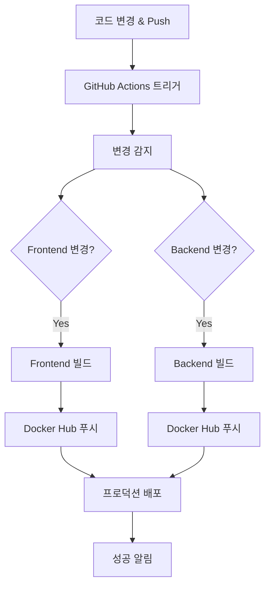

# Docker Hub & GitHub Actions CI/CD 완전 가이드

> 레시피 앱을 위한 자동화된 Docker 이미지 빌드 및 배포 시스템

## 📋 목차
1. [개요](#개요)
2. [설정 방법](#설정-방법)
3. [워크플로우 구조](#워크플로우-구조)
4. [프로덕션 배포](#프로덕션-배포)
5. [트러블슈팅](#트러블슈팅)
6. [모범 사례](#모범-사례)
7. [고급 기능](#고급-기능)

## 🎯 개요

### 목표
이 프로젝트는 **변경 감지 기반 Docker 이미지 빌드 및 배포** 전략을 사용합니다.

- 📦 Frontend/Backend 변경 시 해당 서비스만 빌드
- 🚀 Docker Hub에 자동 푸시
- ⚡ 빌드 시간 최적화 및 리소스 절약
- 🌐 멀티플랫폼 지원 (AMD64, ARM64)
- 🔄 프로덕션 환경에서 검증된 이미지 사용

### 전체 흐름



## 🚀 설정 방법

### 1단계: Docker Hub 계정 설정

#### Docker Hub 계정 생성
1. https://hub.docker.com 접속
2. **"Sign Up"** 클릭해서 계정 생성
3. **사용자명을 기억해두세요** (이미지 이름에 사용됨)

#### Access Token 생성
1. 로그인 후 **Account Settings** → **Security**
2. **"New Access Token"** 클릭
3. 설정:
   ```
   Token description: github-actions
   Access permissions: Read, Write, Delete
   ```
4. **"Generate"** 클릭
5. **⚠️ 중요: 생성된 토큰을 복사** (한 번만 표시됨)
   ```
   예: dckr_pat_1234567890abcdef...
   ```

### 2단계: GitHub Secrets 설정

1. **GitHub 리포지토리 이동**
   ```
   Repository → Settings → Secrets and variables → Actions
   ```

2. **필수 Secrets 추가**

| Secret 이름 | 설명 | 예시 |
|---|---|---|
| `DOCKER_HUB_USERNAME` | Docker Hub 사용자명 | `myusername` |
| `DOCKER_HUB_ACCESS_TOKEN` | 위에서 생성한 토큰 | `dckr_pat_...` |

각 Secret 추가 방법:
- **"New repository secret"** 클릭
- **Name**: Secret 이름 입력
- **Secret**: 값 입력
- **"Add secret"** 클릭

### 3단계: 워크플로우 실행

#### 자동 실행 (권장)
다음 상황에서 자동으로 실행됩니다:
- `main`, `develop`, `feat/docker-deployment` 브랜치에 push
- Pull Request 생성 (빌드만 수행, 푸시는 안함)
- Git 태그 생성 (`v*` 패턴)

#### 수동 실행
- GitHub → Actions → "Build and Push Docker Images" → "Run workflow"

## 🏗️ 워크플로우 구조

### 파일 위치
```
.github/
└── workflows/
    └── docker-build-push.yml
```

### Job 구성
```yaml
jobs:
  detect-changes:    # 변경 감지
  build-frontend:    # 프론트엔드 빌드
  build-backend:     # 백엔드 빌드  
  notify-success:    # 성공 알림
```

### 🔍 변경 감지 메커니즘

```yaml
- name: Detect changes
  uses: dorny/paths-filter@v3
  id: changes
  with:
    filters: |
      frontend:
        - 'frontend/**'
        - 'docker-compose.yml'
        - '.github/workflows/docker-build-push.yml'
      backend:
        - 'backend/**'
        - 'docker-compose.yml'
        - '.github/workflows/docker-build-push.yml'
```

**동작 방식:**
- `frontend/` 폴더 변경 → Frontend만 빌드
- `backend/` 폴더 변경 → Backend만 빌드
- `docker-compose.yml` 변경 → 모든 이미지 빌드
- 워크플로우 파일 변경 → 모든 이미지 빌드

### 🏷️ 태그 전략

```yaml
tags: |
  type=ref,event=branch                           # 브랜치명 기반
  type=ref,event=pr                              # PR 번호 기반  
  type=semver,pattern={{version}}                # 태그 기반
  type=semver,pattern={{major}}.{{minor}}        # 메이저.마이너
  type=sha,prefix={{branch}}-                    # SHA 기반
  type=raw,value=latest,enable={{is_default_branch}}  # latest 태그
```

**결과 예시:**
- `main` 브랜치 → `latest`, `main`
- `feat/docker-deployment` → `feat-docker-deployment`
- PR #123 → `pr-123`
- v1.0.0 태그 → `1.0.0`, `1.0`, `v1.0.0`

### 🌐 멀티플랫폼 지원

```yaml
platforms: linux/amd64,linux/arm64
```

**지원 플랫폼:**
- `linux/amd64`: Intel/AMD 프로세서 (대부분 서버, PC)
- `linux/arm64`: ARM 프로세서 (Apple Silicon, ARM 서버)

**장점:**
- 어떤 환경에서도 동작
- ARM 서버 사용 시 비용 절약
- Apple Silicon Mac에서도 정상 동작

### 💾 캐시 전략

```yaml
cache-from: type=gha,scope=frontend
cache-to: type=gha,mode=max,scope=frontend
```

**효과:**
- 빌드 시간 50-80% 단축
- 서비스별 독립적인 캐시
- 의존성 변경 시에만 재다운로드

## 📦 생성되는 이미지

### Frontend
```
docker.io/[USERNAME]/my-recipe-app-frontend:latest
docker.io/[USERNAME]/my-recipe-app-frontend:[branch-name]
docker.io/[USERNAME]/my-recipe-app-frontend:[tag-name]
```

### Backend
```
docker.io/[USERNAME]/my-recipe-app-backend:latest  
docker.io/[USERNAME]/my-recipe-app-backend:[branch-name]
docker.io/[USERNAME]/my-recipe-app-backend:[tag-name]
```

## 🌐 프로덕션 배포

### 환경변수 설정

#### .env.prod 파일 생성
```env
# Docker Hub
DOCKER_HUB_USERNAME=your_username

# Database
MYSQL_ROOT_PASSWORD=secure_password_here
MYSQL_DATABASE=cookwise

# API Keys
FOOD_SAFETY_API_KEY=your_food_safety_api_key
FOOD_SAFETY_SERVICE_ID=COOKRCP01
OPENAI_API_KEY=your_openai_key
```

### 프로덕션 배포 실행

#### 기본 배포
```bash
# Docker Hub 이미지 사용
docker-compose -f docker-compose.prod.yml --env-file .env.prod up -d
```

#### 로그 및 상태 확인
```bash
# 로그 확인
docker-compose -f docker-compose.prod.yml logs -f

# 특정 서비스 로그
docker-compose -f docker-compose.prod.yml logs -f frontend

# 상태 확인
docker-compose -f docker-compose.prod.yml ps
```

#### 업데이트 배포
```bash
# 최신 이미지 다운로드
docker-compose -f docker-compose.prod.yml pull

# 서비스 재시작
docker-compose -f docker-compose.prod.yml up -d

# 또는 한 번에
docker-compose -f docker-compose.prod.yml pull && \
docker-compose -f docker-compose.prod.yml up -d
```

### 배포 스크립트 예제

#### deploy.sh
```bash
#!/bin/bash
# 사용법: ./deploy.sh [production|staging]

ENV=${1:-production}

echo "🚀 Deploying to $ENV environment..."

# 기존 컨테이너 중지
docker-compose -f docker-compose.prod.yml --env-file .env.$ENV down

# 최신 이미지 다운로드
docker-compose -f docker-compose.prod.yml --env-file .env.$ENV pull

# 새 컨테이너 시작
docker-compose -f docker-compose.prod.yml --env-file .env.$ENV up -d

echo "✅ Deployment completed!"
echo "📊 Service status:"
docker-compose -f docker-compose.prod.yml ps
```

## 🐛 트러블슈팅

### ❌ 자주 발생하는 문제들

#### 1. Docker Hub 로그인 실패
```
Error: Username and password required
```

**원인:** GitHub Secrets 설정 문제
**해결책:**
1. GitHub Secrets 확인 (`DOCKER_HUB_USERNAME`, `DOCKER_HUB_ACCESS_TOKEN`)
2. Docker Hub에서 Access Token 재생성
3. Token 권한이 Read, Write, Delete인지 확인
4. Username 대소문자 정확히 입력

#### 2. 빌드 실패
```
ERROR: failed to solve: process "/bin/sh -c ..." did not complete successfully
```

**해결책:**
1. Dockerfile 문법 확인
2. 의존성 패키지 버전 호환성 확인
3. 로컬에서 빌드 테스트: `docker build -t test ./frontend`

#### 3. 권한 오류
```
denied: requested access to the resource is denied
```

**해결책:**
1. Docker Hub 토큰 권한 재확인
2. Repository가 존재하는지 확인 (자동 생성됨)
3. Username 철자 확인

#### 4. 변경 감지 안됨
```
Skipping job due to path filter
```

**해결책:**
1. 파일 경로 패턴 확인
2. 수동 실행으로 강제 빌드
3. 워크플로우 파일 자체를 수정해서 트리거

#### 5. 멀티플랫폼 빌드 실패
```
error: failed to solve: failed to compute cache key
```

**해결책:**
1. Docker Buildx 설정 문제
2. 플랫폼별 의존성 확인
3. 단일 플랫폼으로 먼저 테스트

### 🔧 디버깅 방법

#### 1. GitHub Actions 로그 분석
- Actions 탭 → 실패한 워크플로우 클릭
- 각 Step별 상세 로그 확인
- 플랫폼별 빌드 로그 분석

#### 2. 로컬 테스트
```bash
# 변경된 파일 확인
git diff --name-only HEAD~1 HEAD

# 단일 플랫폼 빌드 테스트
docker build -t test-frontend ./frontend

# 멀티플랫폼 빌드 테스트
docker buildx build --platform linux/amd64,linux/arm64 -t test-frontend ./frontend
```

#### 3. 강제 실행
- GitHub Actions에서 "Run workflow" 사용
- 모든 조건을 무시하고 빌드 실행

## ✅ 모범 사례

### 🔒 보안
```yaml
# Secrets 사용 (하드코딩 금지)
username: ${{ secrets.DOCKER_HUB_USERNAME }}
password: ${{ secrets.DOCKER_HUB_ACCESS_TOKEN }}

# PR에서는 푸시 안함
if: github.event_name != 'pull_request'

# Registry 명시적 지정
registry: ${{ env.REGISTRY }}
```

### ⚡ 효율성
```yaml
# 조건부 실행으로 불필요한 빌드 방지
if: needs.detect-changes.outputs.frontend == 'true'

# 캐시 활용으로 빌드 시간 단축
cache-from: type=gha,scope=frontend
cache-to: type=gha,mode=max,scope=frontend

# 멀티플랫폼 지원
platforms: linux/amd64,linux/arm64
```

### 📝 메타데이터
```yaml
labels: |
  org.opencontainers.image.title=My Recipe App Frontend
  org.opencontainers.image.description=Recipe app frontend service built with Next.js
  org.opencontainers.image.url=https://github.com/${{ github.repository }}
  org.opencontainers.image.source=https://github.com/${{ github.repository }}
```

### 🏷️ 태그 전략
- `latest`: 항상 최신 안정 버전
- `브랜치명`: 개발 중인 기능 테스트용
- `pr-번호`: Pull Request 검토용
- `v1.0.0`: 릴리즈 버전용

## 📈 고급 기능

### 환경별 설정

#### .env.staging
```env
DOCKER_HUB_USERNAME=myuser
MYSQL_ROOT_PASSWORD=staging_password
FOOD_SAFETY_API_KEY=staging_api_key
```

#### .env.production
```env
DOCKER_HUB_USERNAME=myuser
MYSQL_ROOT_PASSWORD=production_password
FOOD_SAFETY_API_KEY=production_api_key
```

### 자동 배포 확장

#### webhook.sh (서버에서 실행)
```bash
#!/bin/bash
# Docker Hub webhook을 받아서 자동 배포

echo "🔄 Received webhook from Docker Hub"

# 최신 이미지 다운로드 및 재배포
cd /path/to/project
./deploy.sh production

echo "✅ Auto-deployment completed"
```

### 모니터링 및 알림

#### Slack 알림 추가
```yaml
- name: Notify Slack
  if: always()
  uses: 8398a7/action-slack@v3
  with:
    status: ${{ job.status }}
    webhook_url: ${{ secrets.SLACK_WEBHOOK }}
```

## 🔍 로그 및 모니터링

### GitHub Actions 로그
- GitHub → Actions → 워크플로우 선택
- 각 Job별 상세 로그 확인
- 실패 시 에러 메시지 분석

### Docker Hub 확인
- https://hub.docker.com/r/[USERNAME]/my-recipe-app-frontend
- https://hub.docker.com/r/[USERNAME]/my-recipe-app-backend
- 이미지 태그 및 빌드 히스토리 확인

### 프로덕션 모니터링
```bash
# 컨테이너 상태 확인
docker-compose -f docker-compose.prod.yml ps

# 리소스 사용량 확인
docker stats

# 로그 실시간 모니터링
docker-compose -f docker-compose.prod.yml logs -f --tail=100
```

## 🎯 결론

이 CI/CD 파이프라인을 통해:

### 개발자에게
- ✅ 코드만 push하면 자동으로 이미지 빌드
- ✅ 로컬 환경과 프로덕션 환경의 완벽한 일치
- ✅ 빠른 피드백 루프

### 운영팀에게
- ✅ 검증된 이미지만 프로덕션 배포
- ✅ 롤백 용이성 (태그별 관리)
- ✅ 환경별 설정 분리

### 전체 팀에게
- ✅ 수동 작업 최소화
- ✅ 배포 과정의 표준화
- ✅ 실수 방지 및 안정성 향상

---

**최종 업데이트**: 2024년 12월  
**버전**: v2.0 (완전 통합 가이드)  
**작성자**: 레시피 앱 CI/CD 팀 